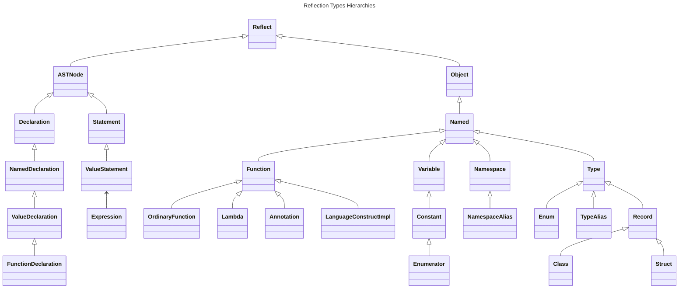

# Atom Design Note: Static Reflection

## Introduction

## Reflection Types Hierarchies (With std-style)

```mermaid
---
title: "Reflection Types Hierarchies"
---
classDiagram
	Reflect <|-- ASTNode
	Reflect <|-- Object
	
	ASTNode <|-- Declaration
	Declaration <|-- NamedDeclaration
	NamedDeclaration <|-- ValueDeclaration
	ValueDeclaration <|-- FunctionDeclaration
	
	ASTNode <|-- Statement
	
	Statement <|-- ValueStatement
	ValueStatement <-- Expression
	
	Object <|-- Named
	
	Named <|-- Function
	Function <|-- OrdinaryFunction
	Function <|-- Lambda
	Function <|-- Annotation
	Function <|-- LanguageConstructImpl
	
	Named <|-- Variable
	Variable <|-- Constant
	Constant <|-- Enumerator
	
	Named <|-- Namespace
	Namespace <|-- NamespaceAlias
	
	Named <|-- Type
	Type <|-- Enum
	Type <|-- TypeAlias
	Type <|-- Record
	Record <|-- Class
	Record <|-- Struct
```

